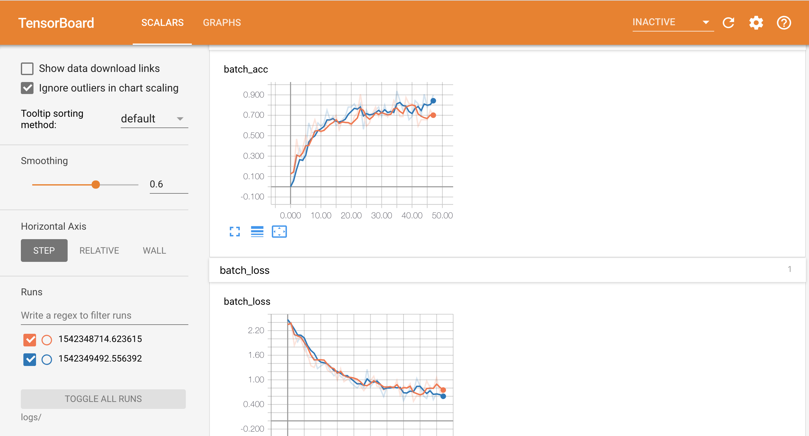

# TensorBoard Example


This is a small example code on how to use tensorboard to visualise the loss and accuracy of your model.

..*This is a code is implemented using keras and the dataset used is the Fashion_MNIST from keras.

If you go through the code you will notice this line,

```from tensorflow.python.keras.callbacks import TensorBoard```

This line of code imports TensorBoard from the tensorflow .
..*You can see that I have used a batch of only 500 images because of GPU constraints.

```tensorboard = TensorBoard(log_dir="logs/{}".format(time()))```

This line of code creates an tensorboard object and mention the directory for tensorboard to save the logs.

```model.fit(train_images , train_labels, epochs = 3 , callbacks=[tensorboard])```

Finally mention tensorboard as one of the callbacks in the Sequential model fit function of Keras.

Also before running this code head back to the terminal and execute the command
```tensorboard --logdir=logs/ ```

This will start tensorboard in the localhost at port 6006.


Hope this tutorial helped you in understanding TensorBoard the visualisation tool created by TensorFlow.
